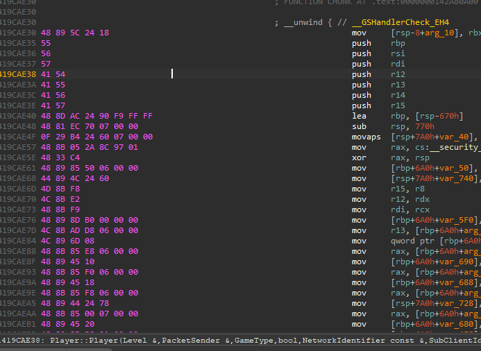
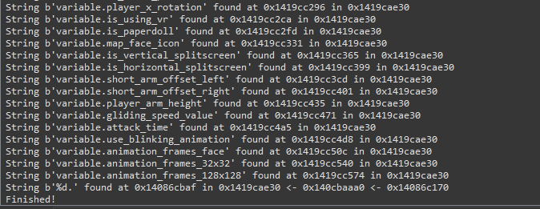

# STRINGS

## [stringpath.py](./stringpath.py)
Resolves a string path to a function

### USAGE

- Put IDA cursor in the func you to generate a string path want to generate a string path to

- Run script
- Enter search depth ( default is 3 )
- Console will output all string paths 

- Path is an xref path