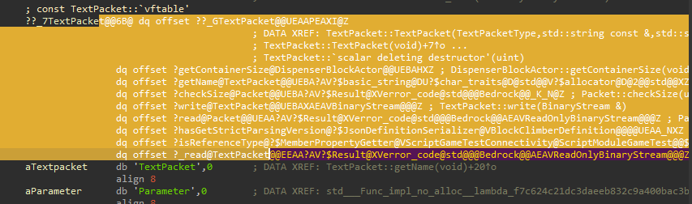
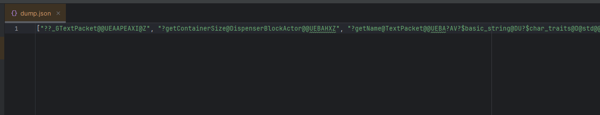
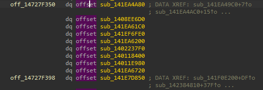
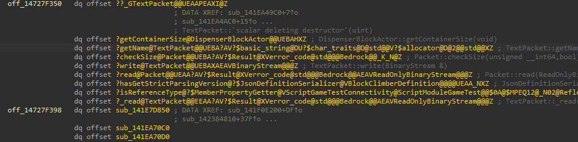
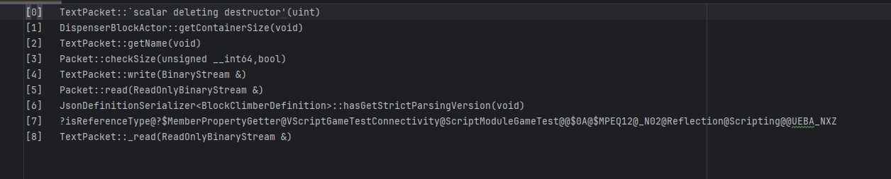

# VTABLES

## [dumper.py](./dumper.py)
Dumps vtables into an output json file containing a list of each function symbol

### Usage:

- Select the segment of a vtable you want to dump

- Run script file
- Enter name for output and press save
- (name).json will now be populated with a list of symbols

## [paster.py](./paster.py)
Pastes output files from dumper.py

### Usage:
- Select start of vtable segment

- Run script file
- Select your (name).json file from dumper.py and press open
- You will now see functions in the vtable named

## [indexdumper.py](./indexdumper.py)
Dumps index and demangled func names from a vtable in `[index]   Name` format

### Usage:
- Select the segment of a vtable you want to dump

- Run script file
- Enter name for output and press save
- (name).txt will now be populated with funcs in `[index]   Name` format
